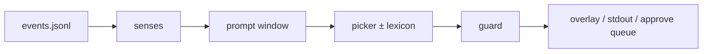

# Fly Cast

[](licenses/AGPL-3.0.txt)
[](licenses/CC-BY-SA-4.0.txt)

This is the mouth for the same larva connectome [Fly Hero](https://github.com/actuallyrizzn/fly-hero) uses for the hands. Text in. English out.

Cue lists, reply banks, and lexicons live under `examples/`. The core library loads a profile and runs.

## Docs

| Doc | |
|-----|--|
| [docs/README.md](docs/README.md) | Index |
| [docs/ARCHITECTURE.md](docs/ARCHITECTURE.md) | How the mouth runs |
| [docs/PROFILES.md](docs/PROFILES.md) | Fork a profile |
| [docs/CLI.md](docs/CLI.md) | Commands |
| [docs/SAFETY.md](docs/SAFETY.md) | Guard + kill switch |
| [docs/CONTRIBUTING.md](docs/CONTRIBUTING.md) | PRs |
| [LICENSING.md](LICENSING.md) | AGPL code / CC-BY-SA everything else |

## Pieces

| Piece | Job |
|-------|-----|
| `flycast` package | Sparse steps on the Winding 2023 larva wiring + a thin translator so words come out |
| Profiles (`profile.toml`) | Your cues, bank, lexicon |
| [`examples/fly_hero/`](examples/fly_hero/) | Flagship: Clone Hero / Fly Hero reactions |

Live default is the **picker** (bank + optional lexicon). Free-write stays available for research. Training claims use the honesty table (fly vs scramble vs no-fly) — see [RESULTS](examples/fly_hero/docs/RESULTS.md).

## Layout

| Path | What’s there |
|------|----------------|
| `src/flycast/` | Core (AGPL) |
| `examples/fly_hero/` | Flagship profile + fixtures + our results |
| `fixtures/` | Generic practice / TinyStories subset |
| `docs/` | Project docs (CC-BY-SA) |
| `licenses/` | Full AGPL + CC-BY-SA texts |
| `tests/` | Coverage gate ≥90% |



## Install

```bash
python3 -m venv .venv
source .venv/bin/activate
pip install -e ".[dev]"
pytest
```

## Try it

```bash
flycast say "hello there"
flycast replay examples/fly_hero/fixtures/events_midtempo.jsonl
flycast live examples/fly_hero/fixtures/events_midtempo.jsonl --state-path /tmp/flycast-state.json
flycast overlay serve --state-path /tmp/flycast-state.json
```

Overlay: `http://127.0.0.1:8766/`. Unset `FLYCAST_PROFILE` → `examples/fly_hero`.

## Use it for something else

1. Copy `examples/fly_hero/` → `examples/your_thing/`
2. Edit `profile.toml`
3. Replace the bank (and lexicon if you want)
4. Point at it:

```bash
export FLYCAST_PROFILE=examples/your_thing
flycast replay path/to/events.jsonl
```

Or: `flycast --profile examples/your_thing replay path/to/events.jsonl`

Shared mouth changes go in `src/flycast/`. Profile work stays under `examples/`. Details: [docs/PROFILES.md](docs/PROFILES.md).

Events are one JSON object per line:

```json
{"t": 1.0, "cue": "YOUR_CUE", "detail": "optional"}
```

## Chat

Same event file, same guard. `flycast.external.reply_to_message` builds a bank reply for cues like `CHAT` / `SOCIAL`. Public posting uses `approve_mode` until you wire a platform adapter. [docs/SAFETY.md](docs/SAFETY.md).

## Data

Larva connectome under `src/flycast/data/` — Winding 2023, **CC-BY** upstream. Same bytes Fly Hero ships. See that folder’s README.

## License

| Material | License |
|----------|---------|
| Code | [AGPL-3.0-or-later](licenses/AGPL-3.0.txt) |
| Docs and other non-code | [CC-BY-SA-4.0](licenses/CC-BY-SA-4.0.txt) |

Full map + third-party notices: [LICENSING.md](LICENSING.md). Connectome CSVs: **CC-BY**. TinyStories subset: **CDLA-Sharing-1.0**.
