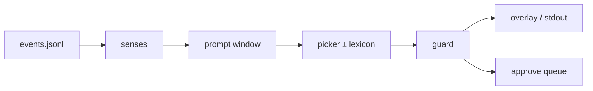

# Architecture

Fly Cast runs activity through the published larva connectome and reads words out the other side. Hands stay in [Fly Hero](https://github.com/actuallyrizzn/fly-hero). This repo is the mouth.



## Layers

| Layer | Module(s) | Job |
|-------|-----------|-----|
| Connectome | `connectome`, `brain` | Load Winding larva graph; sparse `FlyBrain` steps; scramble / no-fly controls |
| Tokens | `tokenizer`, `generate`, `train` | Tiny vocab; Level A ridge readout; optional Level B embed+readout SGD |
| Profile | `profile` | Cue vocab, bank/lexicon paths, what fires live |
| Prompt / bank | `prompt`, `bank`, `lexicon`, `picker`, `react` | Cue → prompt → scored candidates (+ lexicon bonus) |
| Senses | `senses`, `replay`, `live` | Parse / follow `events.jsonl` |
| Safety | `guard`, `external` | Blocklist, URL strip, dedupe, rate limit, kill switch, `approve_mode` |
| Surface | `overlay`, `cli` | Local HTML overlay + `flycast` CLI |

## Events

One JSON object per line:

```json
{"t": 12.34, "cue": "MISS", "detail": "green"}
```

| Field | Role |
|-------|------|
| `t` | Event time (seconds) — HIT throttle + event-time dedupe |
| `cue` | Token from the profile (or anything; unknown cues still prompt) |
| `detail` | Optional — lane, chat snippet, etc. |

Clone Hero is not baked into the core. The profile decides what is interesting (`interesting` cues, plus optional `HIT` + detail match).

## Live default: picker

Free-write loses on small honesty gates. Live scores a **reply bank** under the prompt (`mode=picked`). Lexicon is a soft shove toward phrases you actually want on screen.

`flycast say` and Level A/B generate stay for research. They are not the product path.

## Honesty

If you train, report all three:

| Control | Meaning |
|---------|---------|
| Fly | Real wiring layout |
| Scramble | Same density, partners permuted |
| No-fly | Readout on recent embeds only |

If scramble or no-fly wins, say so. Don’t sell “the wiring is why it talks” off a losing table. Our flagship numbers: [`examples/fly_hero/docs/RESULTS.md`](../examples/fly_hero/docs/RESULTS.md).

## Out of core on purpose

Stream host, bot accounts, music policy, GPU Level C magnitude retunes on `W` — product decisions. Fork the library without carrying our ops.

[Profiles](PROFILES.md) · [CLI](CLI.md) · [Safety](SAFETY.md)
