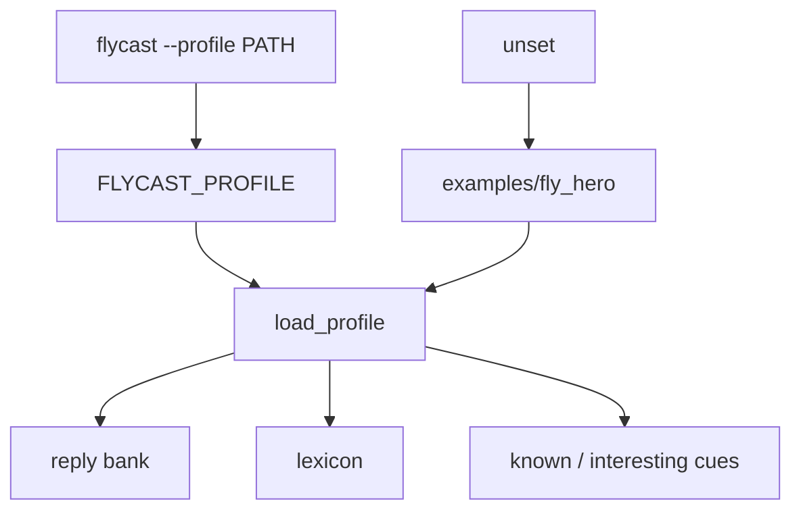

# Profiles

A profile is a folder: `profile.toml` plus fixtures. The library loads it. Your domain stays out of `src/`.



Resolution order:

1. `--profile PATH` (sets `FLYCAST_PROFILE` for the process)
2. `FLYCAST_PROFILE` env (directory or `profile.toml`)
3. `examples/fly_hero/`

## `profile.toml`

```toml
name = "your_thing"
description = "One line for humans."

[paths]
# Relative to this profile directory.
bank = "fixtures/reply_bank.tsv"
lexicon = "fixtures/fly_lexicon.tsv"
events_demo = "fixtures/events_demo.jsonl"   # optional

[cues]
known = ["EVENT", "CHAT", "HIT"]
interesting = ["EVENT", "CHAT"]
# hit_react_detail = "STRUM"
# bank_required = ["EVENT", "CHAT"]   # default: known minus LANE_*

[picker]
lexicon_scale = 0.85
```

| File | Format |
|------|--------|
| Reply bank | `cue <TAB> text` — a few lines per cue you care about; leading `[synth]` is stripped |
| Lexicon | `phrase <TAB> weight` — lowercase; higher weight → soft bonus. Mouth taste. No insect cosplay. |

## Fork it

1. Copy `examples/fly_hero/` → `examples/your_thing/`
2. Edit `profile.toml`
3. Replace bank / lexicon / demo events
4. Run:

```bash
export FLYCAST_PROFILE=examples/your_thing
flycast replay "$FLYCAST_PROFILE/fixtures/events_demo.jsonl"
```

One-shot: `flycast --profile examples/your_thing replay path/to/events.jsonl`.

Change `src/flycast/` only when the shared mouth changes for everyone.

Profile TOML, banks, lexicons, example markdown: **CC-BY-SA-4.0**. Loader code: **AGPL-3.0-or-later**. [LICENSING.md](../LICENSING.md).
