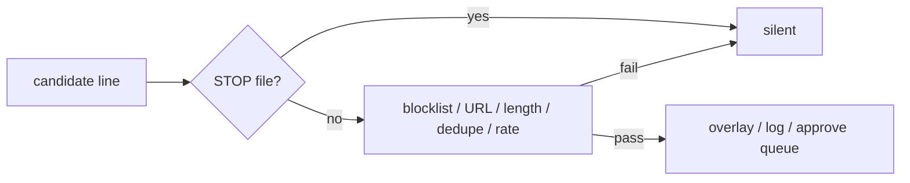

# Safety

Outbound lines go through **`flycast.guard.Guard`** before overlay, guarded stdout, or any later public path.



## Checks

| Check | Behavior |
|-------|----------|
| Kill switch | `stop_path` exists → deny (`kill_switch`) |
| Blocklist | Seed phrases (self-harm, sexual, slurs); expandable |
| URL strip | Drops `http(s)://`, `www.`, `mailto:` spans on allowed lines |
| Length | Caps line length |
| Dedupe | TTL on identical lines; live prefers **event time** |
| Rate limit | Caps how often lines pass |
| Line log | Optional JSONL (`allowed`, `reason`, `cues`, `destination`, …) |

Denied → overlay `mode=silent`, reason in the log / replay line.

## Kill switch

```bash
touch ~/fly-cast/STOP
rm -f ~/fly-cast/STOP
```

`--stop-path` on `replay`, `live`, and `guard`.

## Chat / social

`reply_to_message` picks a bank reply and runs the guard. It does not post.

| Rule | |
|------|--|
| `approve_mode=True` | Default for anything that could go public |
| Log destination | `approve-queue` while approve mode is on |
| Accounts | Not in this repo — name a platform before you turn approve off |

Fixture chat lines: e.g. `examples/fly_hero/fixtures/chat_social.tsv`.

## HIT throttle

Live follow spaces `HIT` reactions (~5s event time by default) so strum spam does not own the overlay. Profile `interesting` cues still fire.

This is a mouth guard, not a moderation product and not a ToS waiver.
