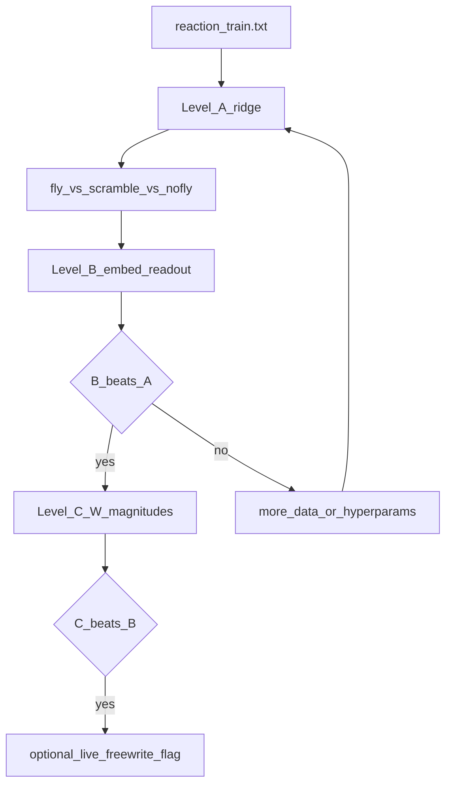

# Free-write climb path

Fly Hero **live** stays on the picker. This track climbs **free-write** on CPU with honesty gates.



## Run

```bash
. .venv/bin/activate
python tools/climb_reaction_freewrite.py
```

Corpus: `fixtures/reaction_train.txt` vs `fixtures/reaction_heldout.txt` (no exact leak).  
Artifacts: `artifacts/reaction-climb/latest.json`.  
Numbers: [RESULTS.md](RESULTS.md) (reaction climb section).

## Gate

B wins if held-out CE improves by ≥0.05 vs A. Level C only after that. Live free-write only behind an explicit flag after a free-write win.

### Latest run (2026-09-11) — climb v2

| | CE |
|--|-----|
| A fly | 5.09 |
| Scramble | 5.14 |
| No-fly | 5.19 |
| B fly | 5.88 |

**B_LOSES** (+0.79). Fly beats scramble and no-fly on reaction held-out. Readable A samples 6/7 with cue-shaped prompts + `min_tokens`.

Additive path: `flycast write …` and `flycast live … --freewrite` (checkpoint from climb). Picker remains live default.

See [RESULTS.md](RESULTS.md).
