# Free-write climb path

Fly Hero **live** stays on the picker. This track climbs **free-write** on CPU with honesty gates.

```mermaid
flowchart TD
  corpus[reaction_train.txt] --> levelA[Level_A_ridge]
  levelA --> honestyA[fly_vs_scramble_vs_nofly]
  honestyA --> levelB[Level_B_embed_readout]
  levelB --> gateB{B_beats_A}
  gateB -->|yes| levelC[Level_C_W_magnitudes]
  gateB -->|no| iterate[more_data_or_hyperparams]
  iterate --> levelA
  levelC --> gateC{C_beats_B}
  gateC -->|yes| flag[optional_live_freewrite_flag]
```



## Run

```bash
. .venv/bin/activate
python tools/climb_reaction_freewrite.py
```

Corpus: `fixtures/reaction_train.txt` vs `fixtures/reaction_heldout.txt` (no exact leak).  
Artifacts: `artifacts/reaction-climb/latest.json`.  
Numbers: [RESULTS.md](RESULTS.md) (reaction climb section).

## Gate

B wins if held-out CE improves by ≥0.05 vs A. Level C only after that. Live free-write only behind an explicit flag after a free-write win.

### Latest run (2026-09-11)

| | CE |
|--|-----|
| A fly | 3.36 |
| B fly | 4.20 |
| Scramble | 3.35 |
| No-fly | 3.59 |

**B_LOSES** (+0.83). Iterate corpus/hyperparams next; Level C stays parked. See [RESULTS.md](RESULTS.md).
